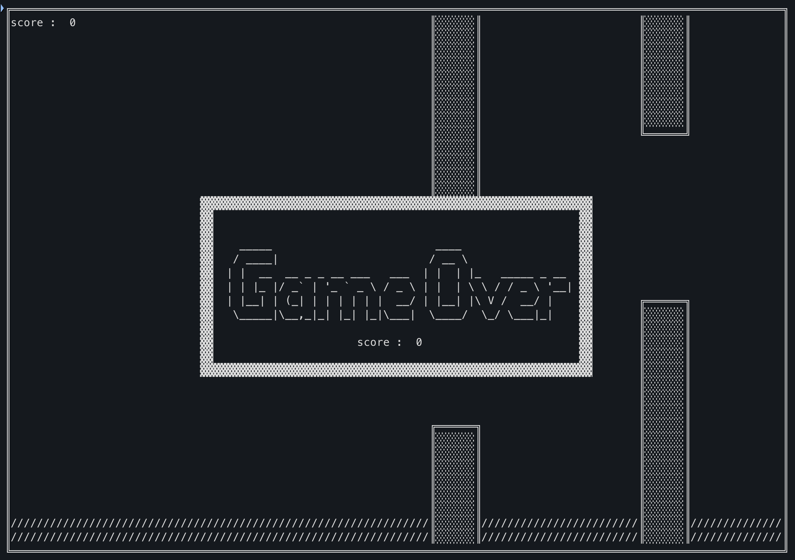

A simple game simulating the gameplay of the world-famous game.

Libraries used:
**fmt**- for classical input/output

**math/rand** - to obtain a random pipe offset

**strconv** - for writing int numbers to string format, for use in the final slice

**strings** - for working with strings and accumulating strings.Builder

**time** - to receive a delay in withdrawal

**keyboard** - for keyboard input operation

Controls:

w, space, KeyArrowUp - jump up

q, ESC output

gameplay screenshots

